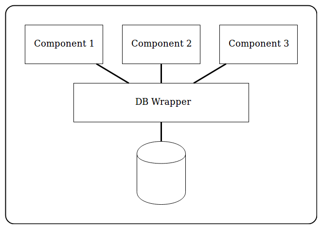

# DB Wrapper

A simple database wrapper class to provide a common API for database access

### Background

This is a simplified version of the database wrapper class I wrote for the Fraud Case study. The point of this design was to allow different components of an application to all use a common set of methods for access a database. Each instance of this class creates its own connection to the database.

